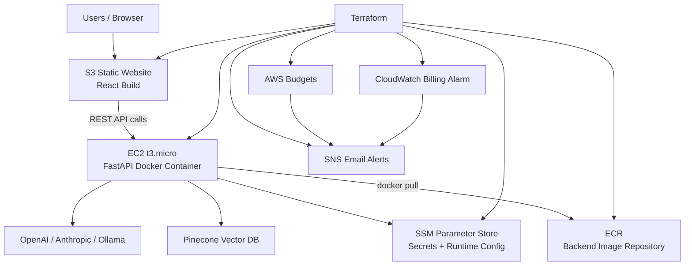
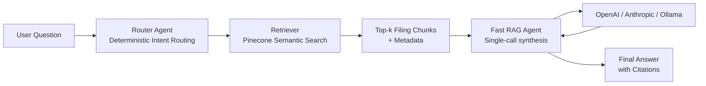

# MAG7 SEC Filings Analyzer

### AI-Powered Financial Intelligence Platform

> A full-stack RAG (Retrieval-Augmented Generation) application that lets users ask natural language questions about SEC filings from the Magnificent 7 tech companies — and get cited, analyst-grade answers in seconds.


---

## Infrastructure (Terraform + AWS)

Provisioned with **Terraform** and deployed on **AWS** with cost guardrails:

- **EC2 (t3.micro)** runs the FastAPI backend container
- **ECR** stores backend Docker images
- **S3 Static Website** hosts the React frontend build
- **SSM Parameter Store** stores runtime secrets/config
- **AWS Budgets + CloudWatch Billing Alarm + SNS** sends cost alerts



Diagram source: `docs/infra-architecture.mmd`

---

## Demo

| Single Company Q&A                                                                                                  | Multi-Company Compare                                                                    |
| ------------------------------------------------------------------------------------------------------------------- | ---------------------------------------------------------------------------------------- |
| Ask any question about a MAG7 stock's SEC filings and receive a cited, LLM-generated answer with source references. | Compare financial metrics, risks, and strategies across multiple companies side-by-side. |

---

## Key Technologies

### 🔥 Core Stack (Strong Highlights)

- **FastAPI + Async Python** for high-throughput backend APIs and agent orchestration.
- **LangChain Multi-Agent RAG** with deterministic routing + single-call fast RAG pipeline.
- **Pinecone Vector Database** for low-latency semantic retrieval across SEC filings.
- **React 18 + Vite** for fast, responsive frontend UX.
- **Terraform on AWS** provisioning EC2, ECR, S3 static hosting, IAM, SSM, Budgets, and CloudWatch billing alerts.

| Layer               | Tech Stack                                                              |
| ------------------- | ----------------------------------------------------------------------- |
| **LLM Providers**   | OpenAI GPT-4o-mini · Anthropic Claude 3.5 Haiku · Ollama (local)        |
| **RAG Pipeline**    | LangChain 0.3 · Custom multi-agent architecture · Deterministic routing |
| **Vector Database** | Pinecone (serverless) · Sentence-Transformers embeddings                |
| **Backend**         | FastAPI · Pydantic v2 · Async Python · Uvicorn                          |
| **Frontend**        | React 18 · Vite · Custom hooks · CSS modules                            |
| **Data Source**     | SEC EDGAR API · 10-K & 10-Q filings                                     |
| **DevOps / Infra**  | Docker · Terraform · AWS EC2/ECR/S3/SSM · AWS Budgets · CloudWatch     |

---

## Architecture

```
┌─────────────────────────────────────────────────────────────┐
│                      React Frontend                         │
│   TickerSelector → ChatWindow → ComparePanel → SECPreview   │
└────────────────────────┬────────────────────────────────────┘
                         │ REST API
┌────────────────────────▼────────────────────────────────────┐
│                    FastAPI Backend                           │
│                                                             │
│  ┌──────────┐   ┌──────────────┐   ┌────────────────────┐  │
│  │  Router   │──▶│  Fast RAG    │──▶│  LLM Provider      │  │
│  │  Agent    │   │  Agent       │   │  (OpenAI/Anthropic/ │  │
│  │(deterministic)│ (single call)│   │   Ollama)           │  │
│  └──────────┘   └──────┬───────┘   └────────────────────┘  │
│                         │                                    │
│              ┌──────────▼───────────┐                       │
│              │   Pinecone Vector DB  │                      │
│              │  (semantic retrieval)  │                      │
│              └───────────────────────┘                       │
└─────────────────────────────────────────────────────────────┘
```

### RAG Agent Flow (Mermaid)



Diagram source: `docs/rag-agent-flow.mmd`

---

## Features

### Intelligent Q&A with Citations

Ask natural language questions about any MAG7 company's SEC filings. The system retrieves relevant filing excerpts, synthesizes an answer, and returns source citations — all in a single optimized LLM call.

### Multi-Agent RAG Pipeline

- **Router Agent** — Deterministic classification (no LLM call) routes queries to the right processing path
- **Fast RAG Agent** — Combined retriever + analyst + reporter in a single LLM call (3x fewer API calls than naive approaches)
- **LLM Cache** — Reusable LLM instances with provider-specific connection pooling

### Multi-Provider LLM Support

Switch between **OpenAI GPT-4o-mini**, **Anthropic Claude 3.5 Haiku**, or **Ollama** (fully local, offline) with a single click in the UI. No code changes required.

### Multi-Company Comparison

Compare financial metrics, risk factors, or business strategies across multiple MAG7 stocks side-by-side. Powered by concurrent API calls for fast results.

### Performance Optimizations

| Metric                    | Before    | After      | Improvement                  |
| ------------------------- | --------- | ---------- | ---------------------------- |
| Repeated query            | 9.69s     | **20ms**   | **485x faster**              |
| Compare 2 stocks (cached) | 12.21s    | **16ms**   | **610x faster**              |
| Frontend re-renders       | Excessive | Memoized   | **React.memo + useCallback** |
| Health check polling      | Every 30s | Every 2min | **4x reduction**             |

### Advanced RAG Controls

Toggle reranking, query rewriting, retrieval caching, section boosting, and hybrid search from the UI control panel — empowering users to experiment with different retrieval strategies.

### Real-Time SEC Data Ingestion

Fetch the latest 10-K and 10-Q filings directly from the SEC EDGAR API, chunk and embed them, and store in Pinecone — all from inside the app.

---

## Project Structure

```
├── backend/
│   ├── app/
│   │   ├── agents/              # Multi-agent RAG system
│   │   │   ├── router_agent.py  #   Deterministic query classifier
│   │   │   ├── fast_rag.py      #   Single-call RAG pipeline
│   │   │   ├── llm_cache.py     #   Provider-aware LLM caching
│   │   │   ├── retriever_agent.py
│   │   │   ├── analyst_agent.py
│   │   │   └── reporter_agent.py
│   │   ├── services/            # SEC EDGAR API, text processing
│   │   ├── utils/               # HTTP client, request deduplication
│   │   ├── main.py              # FastAPI app with lifespan management
│   │   ├── models.py            # Pydantic v2 request/response schemas
│   │   ├── config.py            # Environment-based settings
│   │   └── pinecone_client.py   # Vector DB client
│   ├── tests/                   # pytest suite
│   ├── requirements.txt
│   └── Dockerfile
├── frontend/
│   ├── src/
│   │   ├── components/          # React 18 components (memoized)
│   │   │   ├── ChatWindow.jsx   #   Message display + auto-scroll
│   │   │   ├── ChatInput.jsx    #   User input with model selector
│   │   │   ├── ComparePanel.jsx #   Multi-stock comparison
│   │   │   ├── ControlPanel.jsx #   RAG parameter controls
│   │   │   ├── TickerSelector.jsx
│   │   │   └── SECPreviewModal.jsx
│   │   ├── services/api.js      # API client with timeout/retry
│   │   └── App.jsx
│   ├── vitest.config.js         # Frontend test config
│   ├── package.json
│   └── Dockerfile
├── docker-compose.yml           # One-command full stack launch
├── start-all.sh                 # Dev startup script
└── README.md
```

---

## Quick Start

### Prerequisites

- **Python 3.9+** — Backend runtime
- **Node.js 18+** — Frontend tooling
- **API Keys** — Pinecone + at least one LLM provider (OpenAI, Anthropic, or Ollama)

### 1. Configure

```bash
cd backend
cp .env.example .env
# Edit .env with your API keys
```

### 2. Install

```bash
# Backend
cd backend
python -m venv venv
source venv/bin/activate    # Windows: venv\Scripts\activate
pip install -r requirements.txt

# Frontend
cd ../frontend
npm install
```

### 3. Launch

```bash
# Option A — One command
bash start-all.sh

# Option B — Docker
docker-compose up -d
```

| Service            | URL                        |
| ------------------ | -------------------------- |
| Frontend           | http://localhost:5173      |
| Backend API        | http://localhost:8000      |
| API Docs (Swagger) | http://localhost:8000/docs |

---

## Testing

```bash
# Backend
cd backend
pytest tests/ -v
pytest tests/ --cov=app          # with coverage

# Frontend
cd frontend
npm test                          # run all tests
npm test -- --coverage            # with coverage
```

---

## Sample Questions

**Financial Performance**

- "What was Apple's total revenue and operating income in 2023?"
- "How did NVIDIA's data center revenue grow compared to last year?"
- "What are Tesla's gross margins and how have they changed?"

**Risk & Strategy**

- "What are the key risk factors for Microsoft?"
- "What is Google's AI strategy according to their latest filings?"
- "What cybersecurity risks does Amazon face?"

**Company Comparisons**

- "Compare NVIDIA and AMD's GPU market performance and revenue"
- "How do Apple and Microsoft's R&D investments compare?"
- "Compare Amazon and Google's cloud infrastructure spending"

---

## Technical Highlights

- **Single-call RAG** — Combines retrieval + analysis + generation in one LLM call, reducing latency by ~3x vs. sequential agent chains
- **Deterministic routing** — Zero-cost query classification without burning an LLM call
- **Retrieval caching** — MD5-hashed cache keys with configurable TTL for instant repeated lookups
- **Request deduplication** — Concurrent identical requests share a single pipeline execution
- **Provider-agnostic LLM layer** — Swap OpenAI ↔ Anthropic ↔ Ollama with no code changes
- **Async-first backend** — Full async/await from endpoint to LLM call for maximum throughput
- **Pre-loaded embeddings** — Sentence-Transformers model loaded at startup, not on first request

---

## License

MIT
